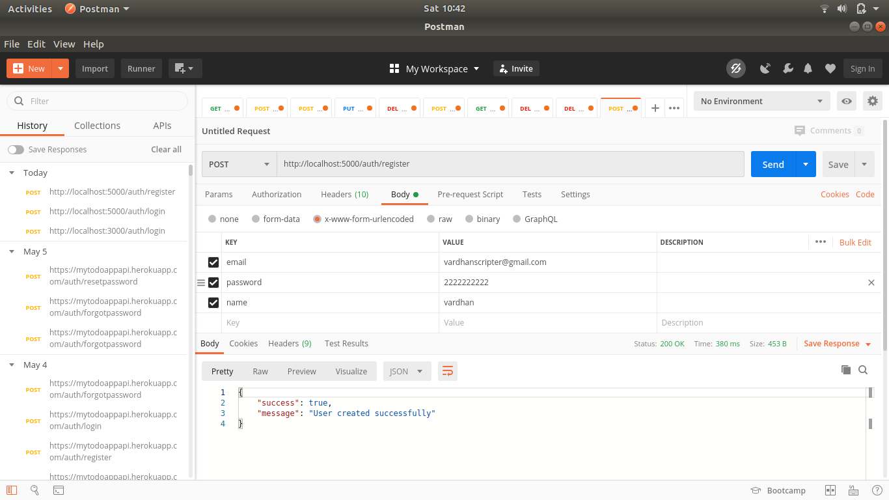
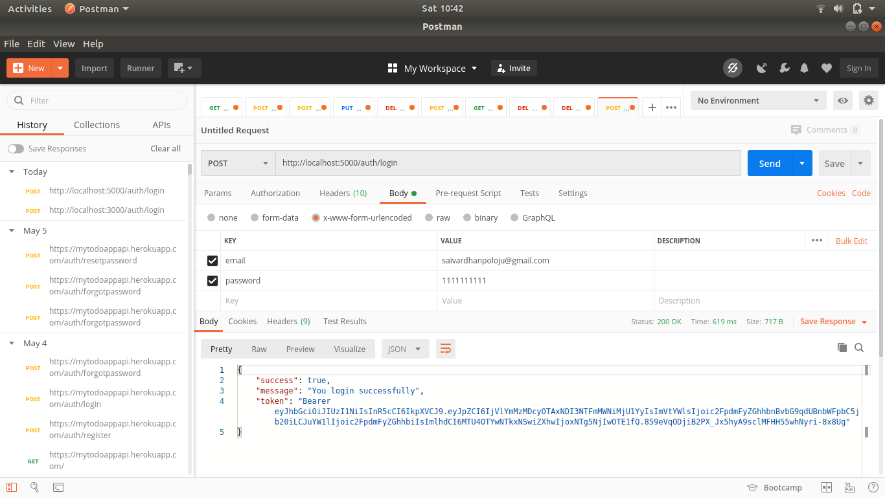
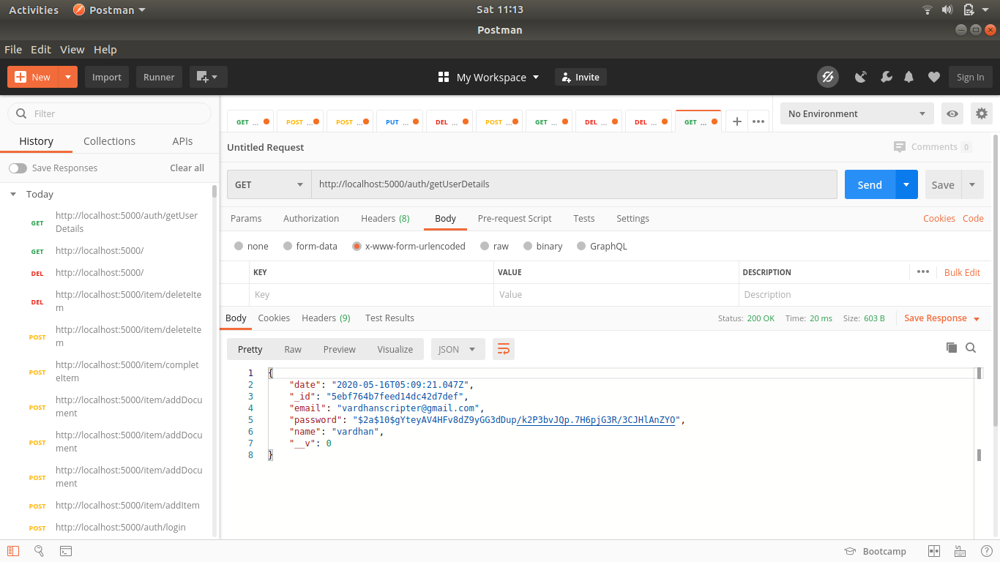
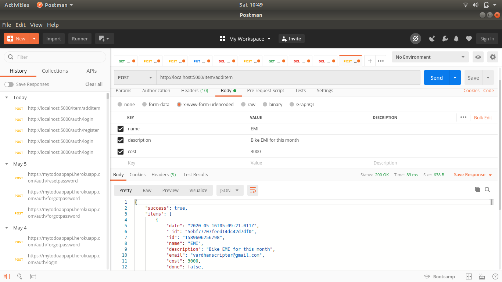
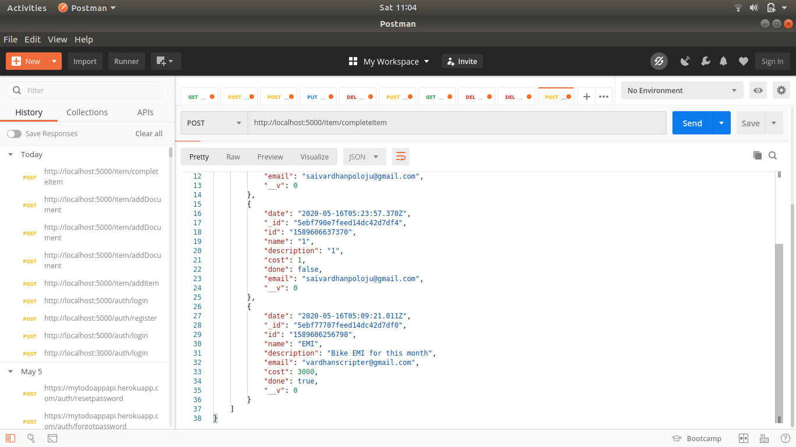
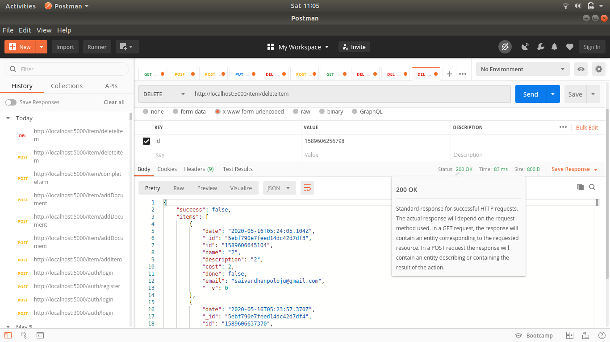
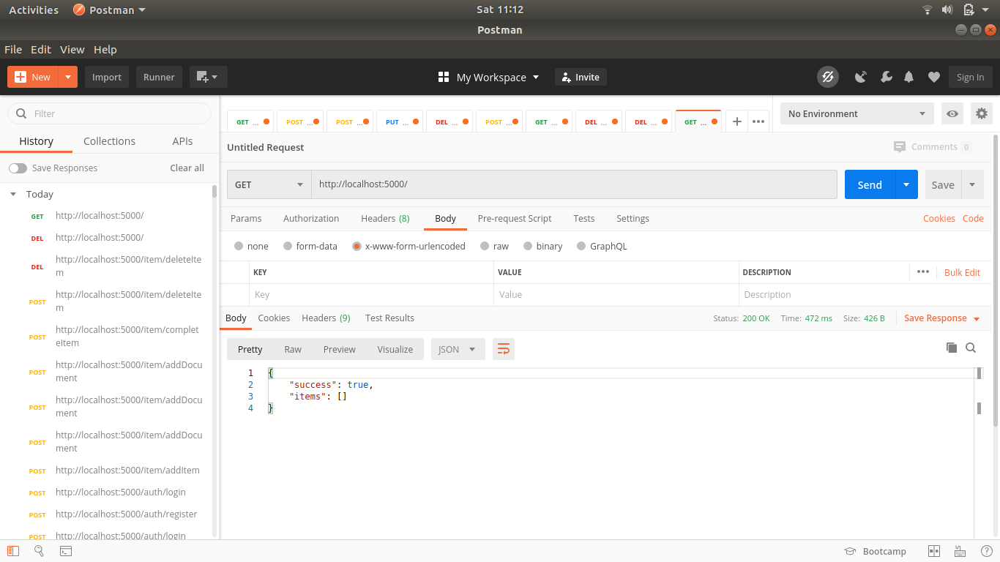

# Personal Budget Application REST API
## Description: 
This is a simple REST API developed with NodeJS. The main theme behind this application is to provide all CRUD operations for Personal Management Application.
* The set of API's provided in this application are
    ```
        1. register
        2. login
        3. getUserDetails
        4. addItem
        5. addDocument
        6. completeItem
        7. deleteItem
        8. getItems
    ```
## Prerequisites:
* node v8.10.0
* npm v3.5.2
* express
* mongoose
* bodyparser
* passport
* jsonwebtoken
* bcryptjs
## Setup and Run:
1. npm install
2. nodemon
## API's and Usage:
1. register
    * Details:
        ``` 
        @type: POST
        @route: http://localhost:5000/auth/register
        @access: PUBLIC
        @description: This is route for new user registration
        ```
    * Request-Structure: 
        ```
        body: {
                email: "yourmail@mailprovider.com"
                password: "**********"
                name: "Your fullname"
            }
        ```
    * Response-Structure:
        ```
        {
            success: true,
            message: "Registration completed successfully"
        }
         or 
        {
            success: false,
            message: "email is already exists"
        }
         or 
        {
            success: false, 
            message: "Internal server error"
        }
        ```
    * Example: 

        
2. login
    * Details:
        ``` 
        @type: POST
        @route: http://localhost:5000/auth/login
        @access: PUBLIC
        @description: This is route for user login
        ```
    * Request-Structure: 
        ```
        body: {
                email: "yourmail@mailprovider.com"
                password: "**********"
            }
        ```
    * Response-Structure:
        ```
        {
            success: true,
            message: "You login successfully",
            token: "Bearer token"
        }
         or 
        {
            success: false,
            message: "credentials mismatch"
        }
         or 
        {
            success: false, 
            message: "Internal server error"
        }
        ```
    * Example: 
    
        
3. getUserDetails
    * Details:
        ``` 
        @type: POST
        @route: http://localhost:5000/auth/getUserDetails
        @access: PUBLIC
        @description: This is route to request user details
        ```
    * Request-Structure: 
        ```
        Headers: {
                Authorization: "Bearer token"
            }
        ```
    * Response-Structure:
        ```
        {
            _id: "Id of user record",
            email: "Email id of user",
            password: "User password hashcode",
            name: "Name of User",
            date: "Date of user creation",
        }
        ```
    * Example: 
    
        
4. addItem
    * Details:
        ``` 
        @type: POST
        @route: http://localhost:5000/item/addItem
        @access: PRIVATE
        @description: This is route to add new Item
        ```
    * Request-Structure: 
        ```
        Headers: {
                Authorization: "Bearer token"
            }
        body: {
                name: "item name",
                description: "description",
                cost: "cost of item",
            }
        ```
    * Response-Structure:
        ```
        {
            success: true,
            message: "Item added successfully",
            items : [
                        {
                            name: "todo1 name",
                            description: "description1",
                            cost: "cost of item1",
                        },
                        {
                            name: "todo2 name",
                            description: "description3",
                            cost: "cost of item2",
                        },...
                    ]
        }
         or 
        {
            success: false, 
            message: "Error in inserting item"
        }
         or 
        {
            success: false, 
            message: "Internal server error"
        }
        ```
    * Example: 

        
5. addDocument
    * Details:
        ``` 
        @type: POST
        @route: http://localhost:5000/item/addDocument
        @access: PRIVATE
        @description: This is route to add array of items
        ```
    * Request-Structure: 
        ```
        Headers: {
                Authorization: "Bearer token"
            }
        body: {
            items : [
                        {
                            name: "todo1 name",
                            description: "description1",
                            cost: "cost of item1",
                        },
                        {
                            name: "todo2 name",
                            description: "description3",
                            cost: "cost of item2",
                        },...
                    ]
            }
        ```
    * Response-Structure:
        ```
        {
            success: true,
            message: "Document added successfully"
        }
         or 
        {
            success: false, 
            message: "Error in inserting document"
        }
         or 
        {
            success: false, 
            message: "Internal server error"
        }
        ```
6. completeItem
    * Details:
        ``` 
        @type: POST
        @route: http://localhost:5000/item/completeItem
        @access: PRIVATE
        @description: This is route to complete item based on id
        ```
    * Request-Structure: 
        ```
        body: {
                id: "Id of item"
            }
        ```
    * Response-Structure:
        ```
        {
            success: true,
            message: "No Item found",
        }
         or 
        Automatic redirect to getItems request
         or 
        {
            success: false, 
            message: "Internal server error"
        }
        ```
    * Example: 

        
7. deleteItem
    * Details:
        ``` 
        @type: DELETE
        @route: http://localhost:5000/item/deleteItem
        @access: PRIVATE
        @description: This is route to delete item based on id
        ```
    * Request-Structure: 
        ```
        body: {
                id: "Id of item"
            }
        ```
    * Response-Structure:
        ```
        {
            success: true,
            message: "Item deleted successfully",
            items : [
                        {
                            name: "todo1 name",
                            description: "description1",
                            cost: "cost of item1",
                        },
                        {
                            name: "todo2 name",
                            description: "description3",
                            cost: "cost of item2",
                        },...
                    ]
        }
         or 
        {
            success: false, 
            message: "Error in deleting item"
        }
         or 
        {
            success: false, 
            message: "Internal server error"
        }
        ```
    * Example: 

        
8. getItems
    * Details:
        ``` 
        @type: GET
        @route: http://localhost:5000/
        @access: PRIVATE
        @description: This is route to get Items
        ```
    * Request-Structure: 
        ```
        Headers: {
                Authorization: "Bearer token"
            }
        ```
    * Response-Structure:
        ```
        {
            success: true,
            items : [
                        {
                            name: "todo1 name",
                            description: "description1",
                            cost: "cost of item1",
                        },
                        {
                            name: "todo2 name",
                            description: "description3",
                            cost: "cost of item2",
                        },...
                    ]
        }
         or 
        {
            success: false, 
            message: "Internal server error"
        }
        ```
    * Example: 

        