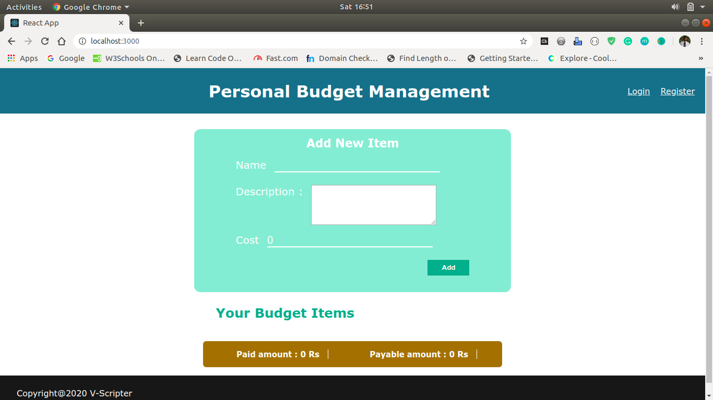
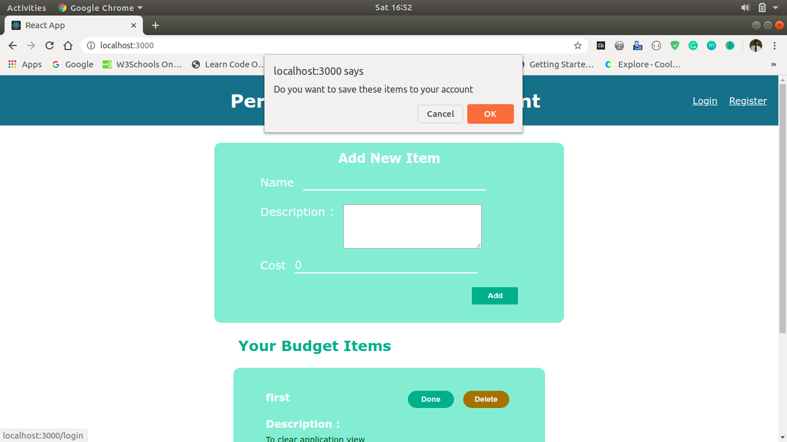
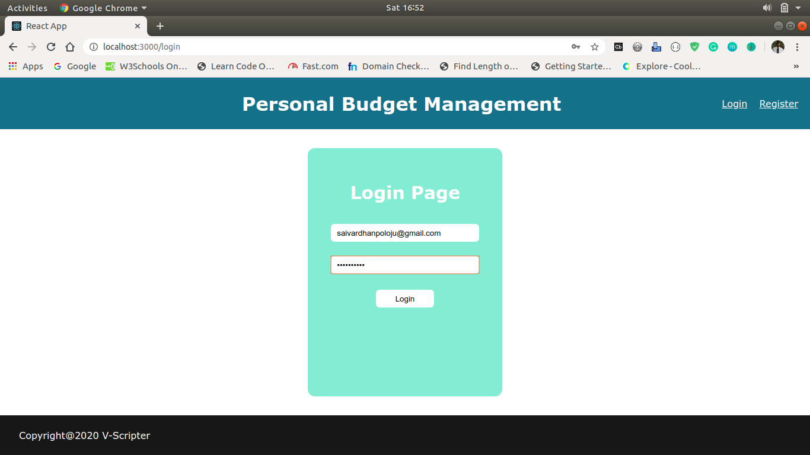
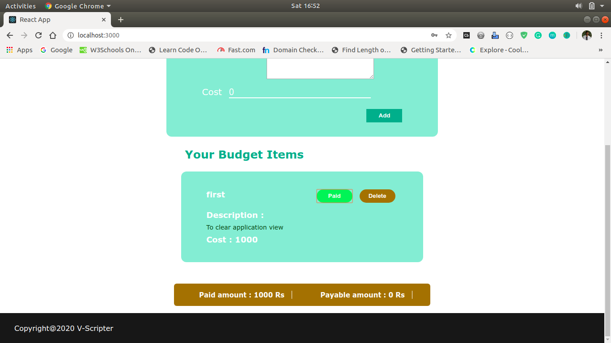
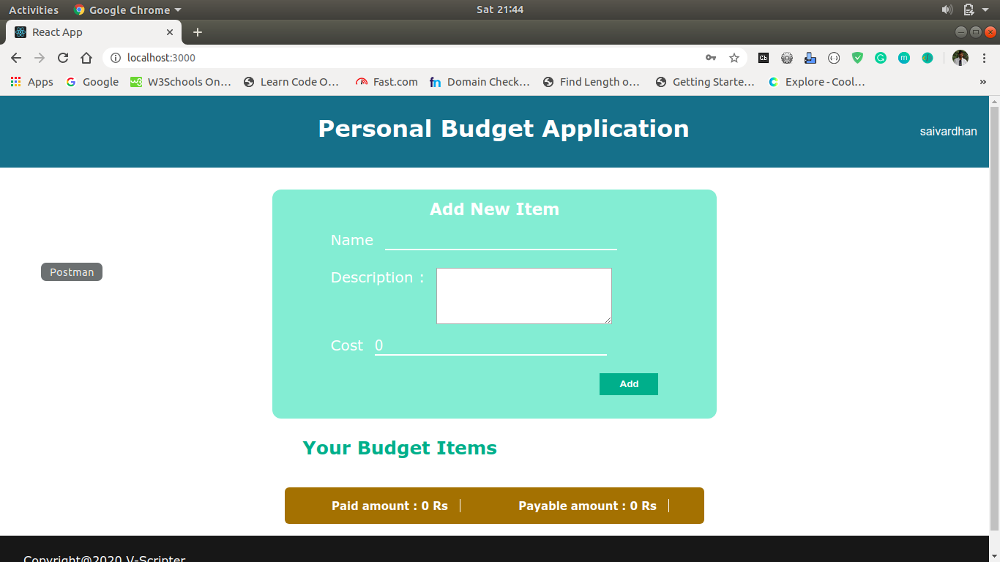

# Personal Budget React Application
## Description: 
This is a simple ReactJS application for Personal Budget Management. The main theme behind this project is to provide the user flexibility in designing their monthly budget. This React application is integrating with REST API's developed in NodeJS. My idea is to create a simple MERN application.
* The features provided in this application are
  1. offline usage of application without account creation
  2. Storing offline data to user account
  3. Login, Registration, Add, Complete, Delete API requests.
## Prerequisites:
* node v8.10.0
* npm v3.5.2
* create-react-app v3.4.1
* react-router-dom
* react-beforeunload
## Setup and Run:
1. npm install
2. npm start
## Screenshots
### 1. Offline mode Homepage
  
### 2. After adding new item
  
### 3. Data storage confirmation
  
### 4. Login Page
  
### 5. User Homepage
  
### 6. Completing Item
  
### 7. Deleting Item
  